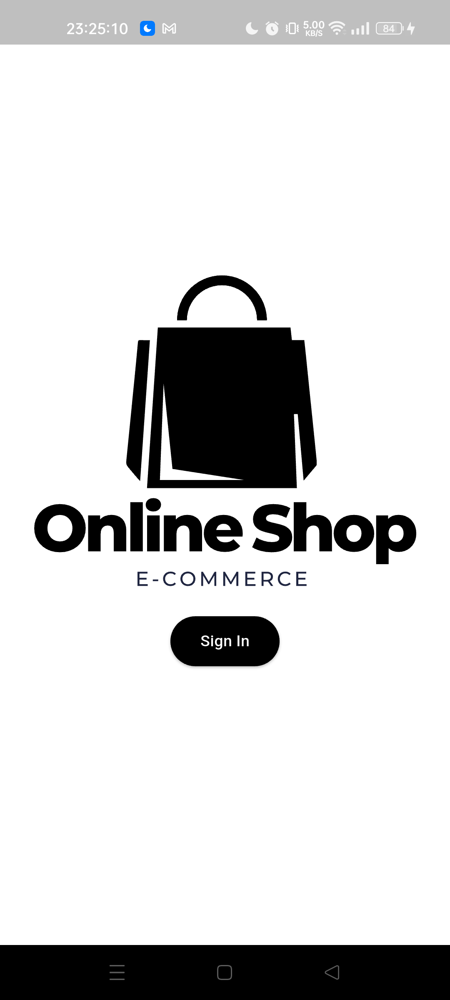
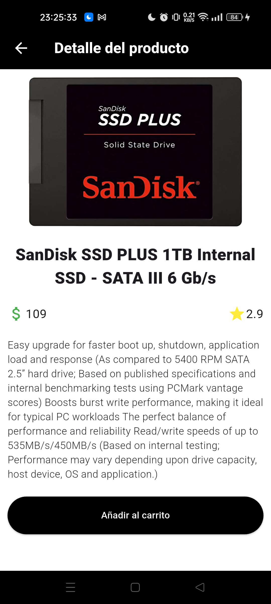
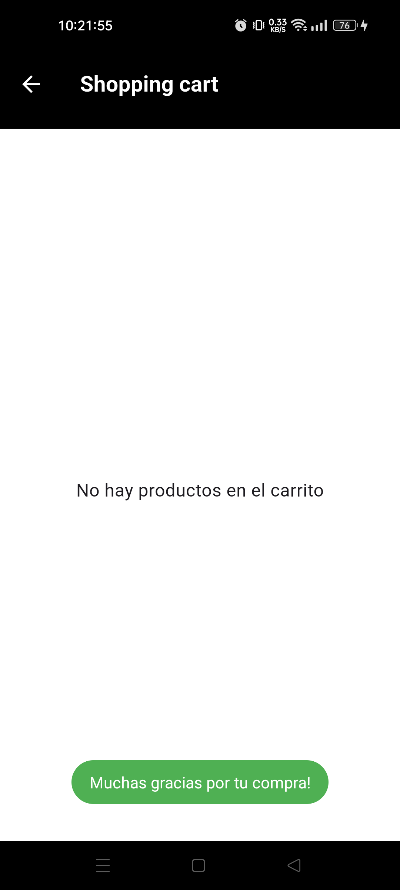

# 🛒 Shopping Cart App - Flutter

<p align="center">
  
</p>

Una aplicación de carrito de compras construida con **Flutter**, que consume productos desde la API pública [FakeStoreAPI](https://fakestoreapi.com/products). Permite explorar productos, agregarlos al carrito, y ver un resumen total de la compra.

---

## 📱 Capturas de pantalla

<p align="center">
  
  
  
  
  
</p>

---

## 📱 Validaciones

<p align="center">
  
  
  
</p>

---

## 🧩 Funcionalidades

- Listado de productos desde la API [FakeStoreAPI](https://fakestoreapi.com/products)
- Vista detallada de cada producto
- Agregar productos del carrito
- Eliminar productos del carrito (Próximamente)
- Visualización de los productos en el carrito (Próximamente) 
- Visualización del total de la compra (Próximamente) 

---

## ⚙️ Instalación

1. Clona este repositorio:
   ```bash
   https://github.com/FranciscoMelen10/shopping_cart.git
